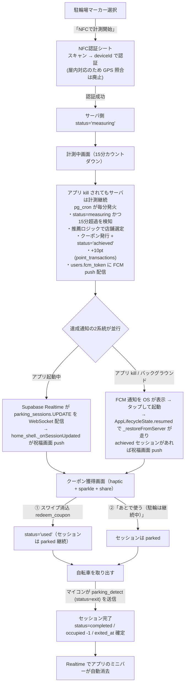
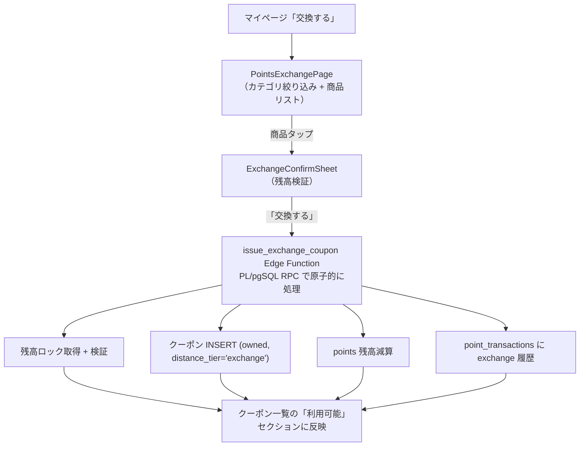
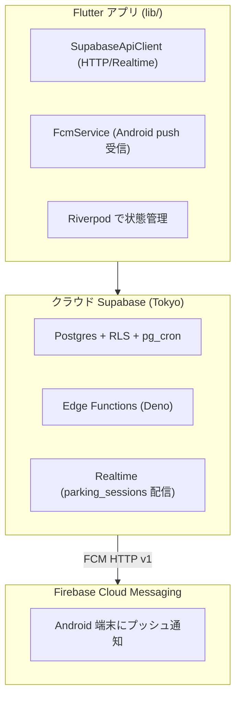

# 🚲 BicycleGo

「駐輪場が空いていない → 放置自転車につながる」問題を、**地図 × インセンティブ（クーポン）** で解決する駐輪支援アプリです。
ユーザーの現在地・駐輪場の空き状況・距離をもとに、**少し遠い駐輪場でも選びたくなる仕組み**を提供します。

---

## 📌 コンセプト

- **罰則ではなくご褒美**で正規駐輪を促す
- 提携店舗のクーポンを**広告チャネル**として活用
- 少し遠くに停めるほど豪華なクーポン → **隠れた名店との出会い**を創出

---

## 🎯 解決したい課題

- 近くの駐輪場が満車だと遠くまで行くのが面倒 → 放置自転車が発生
- 駐輪場の稼働率が偏っており、空きリソースが使われていない
- 提携店舗側も「近くを通っているのに気付かれない」機会損失を抱えている

---

## 🗺 アプリ構成

起動フローは **オンボーディング → ログイン/ゲスト選択（AuthLanding）→ ホーム**。
ログイン済み or ゲスト承認済みなら AuthLanding はスキップされます。ホームは
ボトムナビゲーションで3タブ構成です。

| タブ | 画面 | 役割 |
| --- | --- | --- |
| 地図 | [ParkingMapPage](lib/features/parking/presentation/parking_map_page.dart) | 駐輪場・配信中クーポンの地図表示 + 駐輪開始導線 |
| クーポン | [CouponListPage](lib/features/coupons/presentation/coupon_list_page.dart) | 配信中／利用可能／使用済／期限切れクーポン一覧 |
| マイページ | [MyPage](lib/features/mypage/presentation/my_page.dart) | ポイント残高・所持クーポン・メニュー |

---

## 📊 実装状況サマリ

| 領域 | 機能 | 状態 |
| --- | --- | --- |
| 地図 | 駐輪場/クーポン表示・検索・距離/おすすめソート・フィルタ・アプリ内ルート表示 | ✅ 実装済み |
| 駐輪フロー | NFC認証シート・15分計測・常駐ミニバー・kill後の状態復元 | ✅ 実装済み |
| NFC | スキャンUI・deviceId認証 | ⚠️ タグ内容は未読取（deviceId はモック由来） |
| クーポン | 獲得演出（haptic/sparkle/share）・一覧・詳細・スワイプ消込 | ✅ 実装済み |
| 出庫 | マイコン検知でサーバが自動 `completed` 化 | ✅ 実装済み（サーバ側） |
| ポイント | 残高・交換カタログ・交換確認・交換履歴 | ✅ 実装済み |
| 履歴 | 駐輪履歴一覧（サーバ真実源） | ✅ 実装済み |
| 認証 | メール+PW・ゲスト・匿名→永続昇格・パスワード再設定/変更 | ✅ 実装済み |
| 認証 | アカウント削除（退会）・利用規約/プライバシー同意導線 | ✅ 実装済み（要 `delete_account` デプロイ・規約URL差し替え） |
| 認証 | Google ログイン（ブラウザ OAuth・連携/解除） | ⚠️ アプリ実装済み（Supabase/Google 側の設定待ち） |
| 認証 | Apple ソーシャルログイン | ❌ 未実装 |
| 認証 | メール確認（Confirm email） | ❌ 本番 OFF |
| 認証 | ゲスト→昇格時のローカルデータ引き継ぎ | ❌ 未対応 |
| 通知 | Android プッシュ（FCM） | ✅ 実装済み |
| 通知 | iOS プッシュ（APNs） | ❌ 未対応 |
| 通知 | 24h 長時間駐輪アラート | ❌ 未実装（定数のみ） |
| データ | 駐輪場/店舗マスタ（地図表示） | ✅ Supabase 接続（デバイス解決は一部モック） |
| 品質 | 自動テスト | ⚠️ ドメイン中心の4本のみ |

> 凡例: ✅ 実装済み ／ ⚠️ 部分的・制約あり ／ ❌ 未実装。詳細は各セクションと [未実装機能・既知の制約](#-未実装機能既知の制約) を参照。

---

## 🛠 実装済み機能

### 地図ページ
- 大阪駅周辺を初期表示するGoogle Maps
- **駐輪場マーカー**（稼働率で色分け：緑=空き／橙=混雑／赤=満車近い）
- **クーポンマーカー**（タグ形カスタムアイコン・駐輪場と一目で区別可能）
- **現在地復帰ボタン**
- **駐輪場検索**
  - 検索バー入力／フォーカス時にガラス調の結果ドロップダウンを表示
  - 名称の部分一致でフィルタ
  - 現在地からの距離順に自動ソート
  - 各結果に空き台数（稼働率で色分け）・稼働率・距離を併記
  - タップで該当駐輪場へカメラズーム + 詳細シート自動表示
  - 地図タップまたは✕ボタンで検索状態をクリア
- **配信中クーポンストリップ**（下端の横スクロールカード）
  - 表示／非表示トグル付き（地図を広く見たいときに格納可能）
- **マーカーフィルタチップ**（検索バー下の横並びトグル）
  - `空きのみ` — 満車の駐輪場を除外
  - `クーポンあり` — 300m以内に提携店舗がある駐輪場のみ表示
  - `お気に入り` — お気に入り登録した駐輪場のみ表示
  - 複数条件のAND適用、検索ワードとも併用可能
- **おすすめ順ソート＋おすすめバッジ** — 検索結果ドロップダウンに `距離順／おすすめ順` トグルと `おすすめ +X%` グラデバッジ
  - スコア = 近隣クーポンの豊富さ × 現在地からの距離（遠いほど高スコア）
  - 「近場が満車でも遠くに停めるご褒美」というコンセプトを視覚化
- 駐輪場タップで詳細ボトムシート表示
- クーポンマーカータップで店舗プレビューシート表示
- **アプリ内ルート表示** — 詳細シートの「経路を見る」で Directions API から自転車経路を取得し、地図上に青いポリラインを描画
  - 取得後に自動でルート全体が収まる範囲へカメラズーム
  - 地図上部に[_RouteBanner](lib/features/parking/presentation/parking_map_page.dart)（駐輪場名・距離・所要時間・×ボタン）を表示
  - ✕タップでポリライン・バナーを一括クリア
- **位置情報パーミッションバナー** [LocationPermissionBanner](lib/features/parking/presentation/widgets/location_permission_banner.dart)
  - 拒否／拒否（永続）／サービスOFF を [LocationPermissionNotifier](lib/features/parking/providers/location_permission_providers.dart) で4状態に集約
  - 状態別の見出しと CTA — 「位置情報を許可」「設定アプリを開く」「位置情報の設定を開く」
  - dialog 連打を廃止し、検索バー直下のガラス調バナーに集約

### 駐輪場詳細シート [ParkingDetailSheet](lib/features/parking/presentation/parking_detail_sheet.dart)
- 空き／収容／料金の3カラム表示
- 稼働率プログレスバー（色は稼働率と連動）
- 現在地からの距離・徒歩時間
- 更新時刻チップ
- **「経路を見る」ボタン** — Google Directions API で自転車経路を取得し、アプリ内の地図上にポリラインで表示（距離・所要時間のバナーと×ボタン付き）
- **お気に入り★ボタン** — ヘッダーに常設、1タップでお気に入り登録／解除（端末ローカルに永続化）
- **近くで使えるクーポンセクション** — 300m以内の提携店舗をチップ表示、タップで店舗プレビュー。遠距離ボーナス %も表示
- 「NFCで計測開始」ボタンでNFC認証シートを表示

### 店舗プレビューシート [StorePreviewSheet](lib/features/stores/presentation/store_preview_sheet.dart)
- 配信中バッジ・カテゴリチップ・レコメンド星スコア
- 特典内容をグラデーションカードで強調
- 「15分駐輪で自動発行」の説明テキスト

### NFC認証シート [NfcLockSheet](lib/features/nfc/presentation/nfc_lock_sheet.dart)
- NFCスキャンの起動 + ステージ遷移 UI：`待機中 → 認証中 → 成功／エラー`（NFC 非対応端末ではデモモードで自動進行）
- 各ステージでアクセントカラーとアイコンが切り替わる
- 認証は `deviceId` を `parking_auth` Edge Function に送信し、サーバが直近の `unauthenticated` セッションと照合（屋内・隣接スタンド誤判定対策で GPS 照合は廃止）
- 本番では IoT 検知イベントとの紐付けで強化する想定（[docs/server_implementation.md §13](docs/server_implementation.md)）
- エラー時は「もう一度」で再スキャン可能
- ⚠️ **現状の制約** — タグの検出（`onDiscovered`）はするが**タグのペイロード（スタンドID）は未解析**で、`deviceId` は呼び出し元の駐輪場詳細が [mockDevices](lib/features/parking/data/parking_mock_data.dart) から解決した値を使用している。実タグ → スタンドID の読取・照合は未実装（[未実装機能・既知の制約](#-未実装機能既知の制約)参照）

### 計測中画面 [SessionTimerPage](lib/features/sessions/presentation/session_timer_page.dart)
- 認証完了から**15分カウントダウン**
- 円形プログレスインジケータで残り時間を視覚化
- 対象店舗カード（特典プレビュー付き）
- **最小化ボタン** — 画面を閉じてもセッションは背景で継続、ミニバーから再展開可能
- 「計測を中止する」で確認ダイアログ → セッション破棄

### セッションミニバー [SessionMiniBar](lib/features/sessions/presentation/session_mini_bar.dart)
- 計測中は**ボトムナビゲーションの上に常駐**するグラデーションバー
- 残り時間・プログレスをリアルタイム表示
- **全タブから進捗確認可能**（地図／クーポン／マイページ切替時も表示継続）
- タップで計測画面を再展開
- 達成検知は **サーバ pg_cron が判定 → Realtime / FCM でアプリへ通知 → HomeShell が祝福画面に遷移**
- **`parked` モード** — クーポン獲得後も自転車を出していない間は緑グラデの「駐輪中（クーポン獲得済）」バーに切替、累計駐輪時間を表示（情報表示のみ。出庫はマイコンの検知で自動完了）
- **アプリ kill 後の状態復元** — [HomeShell](lib/features/home/presentation/home_shell.dart) の `_restoreFromServer` で起動時に `getActiveSession` を呼び、measuring / achieved / parked のセッションがあれば即時復元。kill → 再起動でもバーが消えない

### クーポン獲得画面 [CouponEarnedPage](lib/features/sessions/presentation/coupon_earned_page.dart)
- 達成バナー（グラデーション + 祝福アイコン）
- 発行されたクーポンの大型カード表示（店舗・特典・有効期限）
- **スワイプto消込**（`SwipeToUse`ウィジェット・店舗スタッフ面前で利用）
- 「あとで使う（駐輪は継続中）」 — クーポンを保存しつつセッションを `parked` 状態に遷移。出庫は自転車取り出し時にマイコンが検知して自動完了
- **入場時の触覚フィードバック** — `HapticFeedback.heavyImpact()` で達成感を物理的にも演出
- **スパークルバースト** [_SparkleBurst](lib/features/sessions/presentation/coupon_earned_page.dart) — バナー周辺で14個のパーティクルが放射状に拡散（CustomPainter、外部依存なし）
- **シェアボタン** — 達成バナー右肩のアイコン。タップで「#BicycleGo で15分駐輪したら ○○ の『△△』クーポンが届いた！」をクリップボードにコピー（追加パッケージ不要、SNS への貼り付けを想定）
- **アプリ kill 状態でのクーポン受取り** — サーバの pg_cron が15分達成を検知して自律発行 + FCM push 配信 → 通知タップでアプリ起動 → [HomeShell._restoreFromServer](lib/features/home/presentation/home_shell.dart) が achieved セッションを検知して自動的にこの画面へ遷移

### 出庫（自動・マイコン検知）
- ユーザーのアプリ操作は不要。**自転車をスタンドから取り出すとマイコンが `parking_detect`（status=exit）を送信**し、サーバがセッションを `completed`（`exited_at` 確定 + 駐輪場 `occupied` -1）に遷移
- アプリは Realtime で `completed`/`expired` 遷移を受信し、ミニバーを自動的に消去・履歴を再 fetch
- クーポン消込（スワイプ）と出庫は分離。クーポンを使ってもセッションは取り出すまで `parked` のまま

### クーポン一覧 [CouponListPage](lib/features/coupons/presentation/coupon_list_page.dart)
- セクション別表示：**配信中 / 利用可能 / 使用済み / 期限切れ**
- 配信中クーポンは店舗一覧から（未取得でも閲覧可能）
- プルダウンで手動リフレッシュ
- 空状態の専用イラスト
- **検索バー** — 店名・特典文の部分一致でフィルタ（[couponSearchQueryProvider](lib/features/coupons/providers/coupon_filter_providers.dart)）
- **並び順トグル** — `新しい順 / 期限が近い順`（[couponSortModeProvider](lib/features/coupons/providers/coupon_filter_providers.dart)）
- カードタップで [CouponDetailPage](lib/features/coupons/presentation/coupon_detail_page.dart) に遷移

### クーポン詳細ページ [CouponDetailPage](lib/features/coupons/presentation/coupon_detail_page.dart)
- ステータスバッジ（利用可能／使用済み／期限切れ）と発行元タグ
- 特典ヒーローカード（`StorePreviewSheet` と統一感のあるグラデ）
- **有効期限カウントダウン** — `あと N日 H時間` 形式で30秒ごとに自動更新
- **「店舗を地図で開く」** — `url_launcher` で Google Maps を外部起動（緯度経度クエリ）
- 利用方法（3ステップ）・クーポン情報テーブル（発行日時／有効期限／使用日時／クーポンID）
- 利用可能なクーポンは画面下部に [SwipeToUse](lib/features/coupons/presentation/widgets/swipe_to_use.dart) を表示。消込は全画面オーバーレイを出さず、その場の状態変化で「確定」を見せる演出 — スワイプ進行→「消込中…」→チェックのバウンド＋リング＋haptic、同時に特典カードへ光の走り→ギフトのポップ→「使用済み」スタンプ→ディム、CTA は「消込完了」無効化、直下に「クーポンを使用しました」を表示
- 使用済み・期限切れは無効状態のラベルカードを表示

### マイページ [MyPage](lib/features/mypage/presentation/my_page.dart)
- ポイント残高カード（グラデーションヒーロー）
- **「交換する」ボタン** — [PointsExchangePage](lib/features/points/presentation/points_exchange_page.dart) に遷移
- 利用可能クーポンの一覧表示（タップで [CouponDetailPage](lib/features/coupons/presentation/coupon_detail_page.dart) へ）
- **お気に入り駐輪場セクション** — 登録済み駐輪場をカード一覧表示、タップで詳細シートを開く（未登録時は誘導文を表示）
- **駐輪履歴メニュー** — 件数バッジ付き、タップで履歴画面に遷移
- **設定メニュー** — テーマ切替・通知権限確認

### ポイント交換 [PointsExchangePage](lib/features/points/presentation/points_exchange_page.dart)
- 残高ヒーローカード + カテゴリ絞り込みチップ（カフェ／グルメ／物販／モビリティ／寄付）
- 商品リスト（[exchangeCatalog](lib/features/points/data/exchange_catalog_data.dart)）
  - 各タイル：アイコン・タイトル・説明・必要ポイント
  - 残高不足の商品は薄表示
- タップで [ExchangeConfirmSheet](lib/features/points/presentation/exchange_confirm_sheet.dart)（必要pt／現在残高／交換後残高を可視化、不足ならボタン無効）
- 交換確定で
  - `api.issueExchangeCoupon` を呼び、**即時 `owned` 状態のクーポン**を発行（駐輪達成と異なり15分待ち不要）
  - ポイント残高を減算
  - [ExchangeHistory](lib/features/points/providers/exchange_providers.dart) に記録（`shared_preferences` に **uid 別**で永続化、キー: `exchange_history_v1_<uid>`。同じ端末でもアカウント間で混ざらない）
  - `userCouponsProvider` を invalidate して利用可能クーポンに反映
- 右上の履歴アイコンから [ExchangeHistoryPage](lib/features/points/presentation/exchange_history_page.dart) — 商品名・交換日時・消費pt を時系列表示

### 駐輪履歴 [SessionHistoryPage](lib/features/sessions/presentation/session_history_page.dart)
- サーバ `parking_sessions` をクエリして発行済みセッションを表示（直近200件）
- 今月の駐輪回数・今月の獲得ポイント・累計のサマリカード（グラデーションヒーロー）
- 各履歴カード — 駐輪場名・日時・所要分・獲得ポイント・発行クーポンの特典文
- pull-to-refresh で再 fetch
- 未獲得時はイラスト付きの空ステート

### 設定 [SettingsPage](lib/features/settings/presentation/settings_page.dart)
- **テーマモード切替** — 端末設定に合わせる／ライト／ダーク の3択。選択は `shared_preferences` に永続化（キー: `app_theme_mode_v1`）
- **アプリバージョン**表示
- [ダークテーマ実装](lib/core/theme/app_theme.dart) — `ColorScheme.fromSeed(brightness: dark)` ベース、[GlassDecoration](lib/core/theme/glass_decoration.dart) もcontext経由でダーク配色に追従

### お気に入り駐輪場 [FavoriteParkings](lib/features/parking/providers/favorite_providers.dart)
- 駐輪場詳細シートの★タップでトグル
- `shared_preferences` で端末ローカルに **uid 別**で永続化（キー: `favorite_parking_ids_v1_<uid>`）。同じ端末でも別アカウントとは混ざらない（サーバ非保存のため別端末へは同期されない）
- 地図の `お気に入り` フィルタ・マイページのセクション表示と連動

### オンボーディング [OnboardingPage](lib/features/onboarding/presentation/onboarding_page.dart)
- 初回起動時に表示される3ステップの PageView
  1. 「近場が満車でも、ちょっと遠くへ」 — コンセプト訴求
  2. 「NFCでサッと計測開始」 — 使い方の説明
  3. 「15分停めるだけでクーポン獲得」 — インセンティブ訴求
- 完了フラグを `shared_preferences` に保存（キー: `onboarding_completed_v1`）し、2回目以降はスキップ
- [app.dart](lib/app.dart) が `appGateProvider` を監視して `OnboardingPage` / `AuthLandingPage` / `HomeShell` を出し分け

### ログイン / アカウント [features/auth](lib/features/auth/)
- **メール+パスワード認証 + ゲスト利用**。オンボーディング後に [AuthLandingPage](lib/features/auth/presentation/auth_landing_page.dart) を表示し、「アカウント作成」「ログイン」「ゲストで続ける」を選べる
- **ゲート判定** [appGateProvider](lib/features/auth/providers/auth_providers.dart) — `onboarding / authLanding / home` を返すソフトゲート。匿名（`isAnonymous`）かつゲスト未承認なら AuthLanding、非匿名 or ゲスト承認済みなら HomeShell
- **匿名 → 永続アカウント昇格** — ゲストが「アカウント作成」すると `updateUser(email, password)` で昇格。**uid 不変**のためポイント・クーポン・履歴を保持したままアカウント化（[server_implementation.md §3.3](docs/server_implementation.md)）
- **別端末ログイン復元** — `signInWithPassword` で auth ユーザーが切替わると [AuthController](lib/features/auth/providers/auth_controller.dart) が `authSessionKeyProvider` をバンプして HomeShell をフル再マウント（Realtime チャンネル `home_session_$uid` を dispose→再 init）+ user スコープ provider を invalidate + FCM トークン再登録
- **パスワード再設定** — [PasswordResetPage](lib/features/auth/presentation/password_reset_page.dart) で `resetPasswordForEmail` → メールのリンク（`io.supabase.bicyclego://login-callback`）→ SDK が `passwordRecovery` 発火 → [SetNewPasswordPage](lib/features/auth/presentation/set_new_password_page.dart)
- **ログイン中のパスワード変更** — [ChangePasswordPage](lib/features/auth/presentation/change_password_page.dart)。現在のパスワードで再認証（`signInWithPassword`）してから `updateUser` で更新
- **Google ログイン（ブラウザ OAuth）** — [GoogleAuthButton](lib/features/auth/presentation/widgets/google_auth_button.dart) をランディング/ログイン/登録/プロフィールに設置。ゲスト（匿名）は `linkIdentity` で **uid 不変連携**しデータを引き継ぎ、それ以外は `signInWithOAuth`。完了は `io.supabase.bicyclego://login-callback` のディープリンクで戻り、`AuthController` が push 済み認証ページを畳む（フラグで OAuth 復帰時のみ）
- **Google 連携 / 解除** — プロフィールから未連携なら連携、連携済み（かつ他のログイン手段が残る場合のみ）解除。最後の1手段は解除不可
- **アカウント削除（退会）** — プロフィールから強確認ダイアログ → [delete_account](supabase/functions/delete_account/index.ts) Edge Function が `auth.admin.deleteUser`（FK カスケードでユーザーデータ削除）→ ローカルセッションを `signOut(scope: local)` で破棄
- **利用規約 / プライバシーポリシー同意** — [LegalConsentText](lib/features/auth/presentation/widgets/legal_consent_text.dart)（みなし同意＋リンク）をランディング/登録に表示。URL は [legal_links.dart](lib/core/config/legal_links.dart)
- **フォーム改善** — パスワード表示/非表示トグル、登録時のパスワード確認欄、メール形式バリデーション、レート制限時の文言出し分け（[auth_form_fields.dart](lib/features/auth/presentation/widgets/auth_form_fields.dart)）
- **サインアウト** — プロフィールのアカウントカードから。匿名ユーザーは自動再生成しない（AuthLanding に戻る）
- お気に入り駐輪場・交換履歴は端末ローカル（`shared_preferences`）保存だが **uid 別にスコープ**。同じ端末でもアカウント間で混ざらず、ゲスト→昇格（uid 不変）では同端末で引き継がれる。サーバ非保存のため**別端末へは同期されない**（認証切替時は [AuthController](lib/features/auth/providers/auth_controller.dart) が再読込）

### プッシュ通知（FCM）
- クーポン発行時に **サーバ自律で** Android プッシュを配信（アプリ kill 中でも届く）
- 送信タイミング：`issue_coupons` Edge Function が 15分達成を検知した瞬間
- アプリ側 [FcmService](lib/core/notifications/fcm_service.dart) が起動時にトークンを取得 → `users.fcm_token` に upsert
- 通知タップで起動した場合、HomeShell の `AppLifecycleState.resumed` 経由で `_restoreFromServer` が動き、`achieved` セッションがあれば祝福画面に自動遷移
- iOS は未対応（後追いで APNs / GoogleService-Info.plist 設定が必要）

### セキュリティ構成
- **APIキーの用途別分離** — Maps SDK キー（iOS/Android ネイティブ）と Directions API キー（Dart）を別々に管理
- **キーのソースコード非含有** — すべて gitignore 済みファイルから読み込み
  - iOS: [Secrets.xcconfig](ios/Flutter/Secrets.xcconfig) → Info.plist `$(MAPS_API_KEY)` → `GMSServices.provideAPIKey`
  - Android: [secrets.properties](android/secrets.properties) → Gradle `manifestPlaceholders` → AndroidManifest `${MAPS_API_KEY}`
  - Dart: [env/dev.json](env/dev.json) → `--dart-define-from-file` → [api_config.dart](lib/core/config/api_config.dart)
- **テンプレファイル方式** — `.example` 付きファイルのみコミット、実キーファイルは個人環境でコピー生成
- **VS Code debug 構成** — [.vscode/launch.json](.vscode/launch.json) で `--dart-define-from-file` を自動付与（F5 で即起動）

---

## 🔄 主要フロー

### 駐輪 → クーポン獲得


### ポイント交換


5分以内にNFC認証されなかった場合は `expire_sessions` cron が `expired` 化（`AuthGraceExpiredException`）。

---

## 🎨 デザインシステム

- **軽量グラスモーフィズム** — `BackdropFilter`を使わず、半透明塗り + 細いボーダー + 柔らかい影で表現（GPU負荷を最小化）
- **カラーパレット** — [app_colors.dart](lib/core/theme/app_colors.dart) に集約。ブランドカラーは**ティール `#00A88F`** を基調に、用途別アクセント（`navigation` = ブルー `#2E7CF6` / `coupon` = オレンジ `#F4A43A`）を併用
- **ガラス装飾** — [glass_decoration.dart](lib/core/theme/glass_decoration.dart) で再利用可能な `BoxDecoration` を提供
- **テーマ** — [app_theme.dart](lib/core/theme/app_theme.dart) でMaterial 3 + Google Fonts（Inter / Noto Sans JP）統一

---

## 🧱 アーキテクチャ



### Flutter 側（lib/）

```
lib/
├── app.dart               # MaterialApp + appGate でゲート出し分け + AuthController watch
├── main.dart              # ProviderScope + Supabase.initialize + Anonymous Sign-In + FCM init
├── routes.dart            # ルート定義
├── core/
│   ├── api/               # ApiClient抽象 + SupabaseApiClient
│   ├── config/            # APIキー・接続先 URL 読み込み
│   ├── notifications/     # FcmService (Firebase Messaging 受信)
│   ├── recommendation/    # クーポン推薦スコアリング
│   ├── theme/             # カラー・グラス装飾・テーマ
│   └── widgets/, utils/   # 共通ウィジェット・ユーティリティ
└── features/
    ├── auth/              # ログイン/新規登録/ゲスト・昇格・PW再設定/変更・Google連携・退会・規約同意
    ├── parking/           # 駐輪場・地図・位置情報パーミッション
    ├── stores/            # 提携店舗
    ├── coupons/           # クーポン・詳細ページ・フィルタ・スワイプ消込
    ├── sessions/          # 計測タイマー・獲得演出・履歴
    ├── nfc/               # NFC認証シート
    ├── points/            # ポイント残高・交換カタログ・交換履歴
    ├── alerts/            # 通知関連プロバイダ
    ├── user/              # ユーザー情報・プロフィール
    ├── mypage/            # マイページ
    ├── settings/          # 設定（テーマ・サポート）
    ├── onboarding/        # 初回起動オンボーディング
    └── home/              # ボトムナビシェル + サーバ状態復元 + Realtime 購読
```

### サーバ側（supabase/）

```
supabase/
├── config.toml                 # Supabase 設定（Anonymous + Google OAuth 有効）
├── seed.sql                    # 駐輪場5・店舗5・デバイス5・カタログ6
├── migrations/
│   ├── initial_schema.sql      # 9テーブル + ENUM + index + auth トリガ
│   ├── rls_policies.sql        # 全テーブル RLS（自分のデータのみ可視）
│   ├── pg_cron_jobs.sql        # 毎分 issue_coupons / expire_sessions
│   ├── long_park_warning.sql   # 24h超の長時間駐輪警告（カラム + index + 毎時 cron）
│   ├── exchange_rpc.sql        # ポイント交換アトミック関数
│   └── cron_helper_for_cloud.sql  # Vault 経由で URL/キー解決
└── functions/                  # Edge Functions（Deno + TypeScript）
    ├── _shared/                # 定数・CORS・型・推薦ロジック
    ├── parking_detect/         # IoT 検知 → unauthenticated session 作成
    ├── parking_auth/           # NFC 認証 → measuring 遷移
    ├── issue_coupons/          # 達成判定 + クーポン自律発行（cron 起動）
    ├── expire_sessions/        # 認証猶予クリーンナップ（cron 起動）
    ├── notify_long_parking/    # 24h超の長時間駐輪を警告 push（cron 毎時起動）
    ├── redeem_coupon/          # スワイプ消込
    ├── end_session/            # 出庫 + occupied 減算
    ├── issue_exchange_coupon/  # ポイント交換（PL/pgSQL RPC 経由でアトミック）
    └── delete_account/         # アカウント削除（退会・admin.deleteUser）
```

**状態管理** — Riverpod (`flutter_riverpod ^2.5.1`)
**API層** — `ApiClient` 抽象 + `SupabaseApiClient` 実装。`apiClientProvider` で DI
**バックエンド** — Supabase（Postgres + Auth + Edge Functions + pg_cron + Realtime）
**プッシュ通知** — Firebase Cloud Messaging（Android のみ・iOS は後追い）
**API契約ドキュメント** — [docs/api_contract.md](docs/api_contract.md)
**サーバ実装ガイド** — [docs/server_implementation.md](docs/server_implementation.md)

---

## 🛠 技術スタック

### フロントエンド
- **Flutter 3.x / Dart**（Material 3）
- **flutter_riverpod** — 状態管理
- **supabase_flutter** — Supabase Auth / DB / Realtime クライアント
- **google_maps_flutter** — 地図表示
- **geolocator** — 位置情報取得 + 設定アプリ起動
- **nfc_manager** — NFCタグ読み取り（`third_party/` にローカルフォーク）
- **firebase_core + firebase_messaging** — FCM 受信（Android）
- **shared_preferences** — お気に入り／オンボーディング状態の永続化
- **url_launcher** — クーポン詳細から外部マップを起動
- **google_fonts** — Inter / Noto Sans JP

### バックエンド（Supabase）
- **Postgres + Row Level Security** — 9テーブル、自分のデータのみ閲覧可
- **Edge Functions（Deno + TypeScript）** — 認証・消込・出庫・交換・FCM 送信
- **pg_cron + pg_net** — 15分達成判定 + クーポン自律発行を毎分、長時間駐輪の警告を毎時スケジュール実行
- **Realtime** — `parking_sessions` の UPDATE をクライアントに WebSocket 配信
- **Vault** — Edge Function URL / service_role key を暗号化保管
- **Supabase Auth** — 匿名サインイン + メール/パスワード認証 + Google OAuth（ブラウザ）。匿名→永続アカウント昇格・Google 連携で uid 不変・データ保持。パスワード再設定/変更、アカウント削除（退会・`admin.deleteUser`）、規約同意導線。パスワード再設定はディープリンク（SMTP は Resend）

### 通知配信
- **Firebase Cloud Messaging (HTTP v1 API)** — `issue_coupons` / `notify_long_parking`
  Edge Function から サービスアカウント JWT で OAuth トークンを取得して直接送信
- **長時間駐輪の警告** — `notify_long_parking` cron（毎時）が 24時間以上駐輪が続く
  セッションを検知し、ユーザーに警告 push を1回送信（しきい値は `LONG_PARK_WARN_SECONDS` で調整可）

### デバイス連携（想定）
- NFCタグ付き駐輪スタンド（屋内対応のため GPS 照合は廃止、deviceId のみで認証）
- IoTセンサーから `parking_detect` Edge Function に検知イベント送信

---

## 🚀 セットアップ（ゼロから環境構築｜Windows / Mac 共通・完全版）

このアプリを**何も入っていないマシン（Windows / Mac）から動かす**ための完全手順です。コマンドは「Mac / Linux（bash・zsh）」と「Windows（PowerShell）」を併記します。**特記がなければ、すべてプロジェクトルート `BicycleGoApp/` で実行**してください。

### 🧩 全体像（3つのプロセスを同時に動かす）

このアプリはローカルで動かすと **3つの部品**が連携します。順番に立ち上げます。

```
┌──────────────┐    HTTP     ┌─────────────────────┐    SQL     ┌──────────────────┐
│ Flutter アプリ │ ──────────▶ │ Supabase (ローカル)   │ ◀───────── │ Python AIサーバー  │
│ (端末/エミュ)   │  地図・認証   │ DB + Edge Functions  │  履歴/店舗   │ recommendation_api │
└──────────────┘             │ (Docker で起動)       │            │ (Flask :5001)     │
        ▲                    └─────────────────────┘            └──────────────────┘
        │ Directions / Maps API（Google Cloud）
        └─ 経路描画・地図タイル
```

| 部品 | 役割 | 起動コマンド（概要） |
| --- | --- | --- |
| **Supabase（ローカル）** | DB・認証・Edge Functions。Docker 上で動く | `supabase start` |
| **Python AIサーバー** | おすすめ店舗のスコア計算（:5001） | `python recommendation_api.py` |
| **Flutter アプリ** | 地図・NFC・クーポンの画面 | `flutter run --dart-define-from-file=env/dev.json` |

> 💡 **ローカル完結 vs 本番接続**：本番クラウド Supabase に繋ぐだけなら Docker / Python は不要で、[開発ワークフロー → 通常起動](#通常起動) に進めます。ただし**AIレコメンドまで含めて手元で完全に再現するにはローカルフルスタック**（このセクション）が必要です。初めての人はまずローカルで一通り動かすことを推奨します。

---

### 0️⃣ 前提ツールのインストール（OS別）

以下を上から順に入れます。インストール後は**ターミナル / PowerShell を開き直して** PATH を反映させてください。

| ツール | 用途 | 必須？ |
| --- | --- | --- |
| Git | リポジトリ取得 | 必須 |
| Flutter SDK（stable, 3.38 系で確認） | アプリ本体のビルド・実行 | 必須 |
| Android Studio（Android SDK + エミュレータ） | Android 実行環境・`flutter doctor` 解決 | 必須 |
| Xcode + CocoaPods | iOS / iOS シミュレータ実行 | **Mac のみ**・iOS をやる場合 |
| Docker Desktop | ローカル Supabase の実行基盤 | ローカル起動に必須 |
| Supabase CLI | DB 起動・マイグレーション・関数 | ローカル起動に必須 |
| Python 3.9+ | AI レコメンドサーバー | ローカル起動に必須 |

#### 🍎 Mac

[Homebrew](https://brew.sh/) を入れてあると最短です。

```bash
# Homebrew（未導入なら）
/bin/bash -c "$(curl -fsSL https://raw.githubusercontent.com/Homebrew/install/HEAD/install.sh)"

# Git / Flutter / Supabase CLI / Python / CocoaPods
brew install git
brew install --cask flutter
brew install supabase/tap/supabase
brew install python@3.12
brew install cocoapods

# Docker Desktop（GUIアプリ。インストール後に必ず起動しておく）
brew install --cask docker

# Android Studio（Android SDK のために必要）
brew install --cask android-studio

# Xcode は App Store からインストール → 初回だけライセンス同意とツール導入
sudo xcodebuild -license accept
xcode-select --install
```

#### 🪟 Windows

[winget](https://learn.microsoft.com/ja-jp/windows/package-manager/winget/)（Windows 10/11 標準）を使うと最短です。**PowerShell を管理者として実行**してください。

```powershell
# Git / Flutter / Supabase CLI / Python
winget install --id Git.Git -e
winget install --id Flutter.Flutter -e          # 入らない場合は下の手動DLを参照
winget install --id Supabase.CLI -e
winget install --id Python.Python.3.12 -e

# Docker Desktop（インストール後に起動。WSL2 バックエンド推奨）
winget install --id Docker.DockerDesktop -e

# Android Studio（Android SDK のために必要）
winget install --id Google.AndroidStudio -e
```

> **Flutter が winget で入らない場合**：[公式の Windows 手順](https://docs.flutter.dev/get-started/install/windows)で zip を `C:\src\flutter` 等に展開し、`C:\src\flutter\bin` を**ユーザー環境変数 PATH に追加** → PowerShell を開き直す。
> **Supabase CLI が winget で入らない場合**：[Scoop](https://scoop.sh/) で `scoop install supabase`、または[Releases](https://github.com/supabase/cli/releases) から exe を取得して PATH の通った場所へ。

#### ✅ 共通：Android Studio の初期設定と doctor 確認

1. Android Studio を一度起動し、セットアップウィザードで **Android SDK / SDK Command-line Tools / Android Emulator** を入れる。
2. ライセンス同意とドクター確認：

   ```bash
   flutter doctor --android-licenses   # 出てくる規約にすべて y
   flutter doctor                      # ✓ が並べばOK（iOSはMacのみ）
   ```

   `flutter doctor` で赤い × が出たら、その案内に従って不足分を解消してください。Windows で「Visual Studio」関連の × はデスクトップ版を作らない限り無視して構いません。

---

### 1️⃣ リポジトリ取得 & Flutter 依存解決

```bash
# 取得（URL は実際のリポジトリに置き換え）
git clone <REPOSITORY_URL>
cd BicycleGo/BicycleGoApp

# Flutter パッケージ取得
flutter pub get
```

**Mac で iOS も動かす場合**は CocoaPods も入れます（Android だけなら不要）。

```bash
cd ios && pod install && cd ..
```

---

### 2️⃣ 設定ファイル・シークレットの配置

git に含まれない設定ファイルを、テンプレート（`*.example.*`）からコピーして値を埋めます。**コピー後に中身を書き換える**のがポイントです。

| コピー元（テンプレ） | コピー先（実ファイル・git管理外） | 中身 |
| --- | --- | --- |
| `env/dev.example.json` | `env/dev.json` | ローカル Supabase URL / anon key / Directions APIキー |
| `ios/Flutter/Secrets.example.xcconfig` | `ios/Flutter/Secrets.xcconfig` | iOS の Maps SDK キー（Mac/iOSのみ） |
| `android/secrets.example.properties` | `android/secrets.properties` | Android の Maps SDK キー |
| `.env.example` | `.env` | Python スクリプト用 DB 接続情報（ローカルなら**作らなくてOK**・後述） |

**Mac / Linux（bash・zsh）**
```bash
cp env/dev.example.json env/dev.json
cp ios/Flutter/Secrets.example.xcconfig ios/Flutter/Secrets.xcconfig   # Mac/iOSのみ
cp android/secrets.example.properties android/secrets.properties
```

**Windows（PowerShell）**
```powershell
Copy-Item env\dev.example.json env\dev.json
Copy-Item android\secrets.example.properties android\secrets.properties
# iOS は Mac 専用なので Windows では不要
```

> 🔑 **Google Maps / Directions APIキーの取得と GCP 側の制限**は下の [APIキーの設定（用途別に2種類）](#apiキーの設定用途別に2種類) を参照。**地図タイルとおすすめ機能を確認するだけ**なら、まず `env/dev.json` の `GOOGLE_DIRECTIONS_API_KEY` を有効なキーにすれば動きます（経路線の描画に使用）。Maps SDK キー未設定だと地図が灰色になります。

`env/dev.json` の `SUPABASE_URL` / `SUPABASE_ANON_KEY` は次のステップで `supabase start` が表示する値に合わせます。エミュレータ別の URL の使い分けは:

| アプリの実行先 | `SUPABASE_URL` に入れる値 |
| --- | --- |
| iOS シミュレータ / Mac デスクトップ | `http://127.0.0.1:54321` |
| **Android エミュレータ** | `http://10.0.2.2:54321` |
| 実機（同一 Wi-Fi） | `http://<PCのLAN IP>:54321` |

---

### 3️⃣ ローカルバックエンド（Supabase）の起動

**Docker Desktop を起動した状態**で実行します（初回は Docker イメージの取得に数分かかります）。

```bash
# DB・認証・Edge Functions をローカルに起動
supabase start

# スキーマを作り直してクリーンな状態に（マイグレーション適用）
supabase db reset
```

`supabase start` の最後に表示される **`API URL`** と **`anon key`** を、ステップ2で作った `env/dev.json` の `SUPABASE_URL` / `SUPABASE_ANON_KEY` に貼り付けます（あとから `supabase status` でも確認可）。

> ブラウザで **Supabase Studio（GUI）= http://127.0.0.1:54323** を開くと、テーブルやデータを直接確認・編集できます。

---

### 4️⃣ データ投入（Python：履歴＋提携店舗）

AI が使う**過去チェックイン履歴（約11万件）**と、地図に出る**提携店舗（30件）**を DB に流し込みます。**`supabase db reset` の直後に必ず1回**実行してください。これをしないと地図に店舗が出ず、レコメンドも動きません。

まず Python の仮想環境を作って依存を入れます。

**Mac / Linux**
```bash
python3 -m venv .venv
source .venv/bin/activate
pip install -r requirements.txt
```

**Windows（PowerShell）**
```powershell
py -3 -m venv .venv
.\.venv\Scripts\Activate.ps1
pip install -r requirements.txt
```
> PowerShell で `Activate.ps1` が実行ポリシーで弾かれる場合：`Set-ExecutionPolicy -Scope CurrentUser RemoteSigned` を一度実行。

そしてデータ投入:

```bash
python load_data.py
```
`Phase 2 complete! All data successfully loaded and calculated.` が出れば成功です。

> ⚠️ **接続先に注意（重要）**：`load_data.py` は環境変数 `DATABASE_URL` があればそこへ、無ければ**ローカル Supabase（`localhost:54322`）**へ書き込みます。**ローカルに投入したいときは `.env` に `DATABASE_URL` を設定しない**でください（`.env` を作らない／その行をコメントアウト）。本番DBに投入したい時だけ `.env.example` をコピーして本番の接続文字列を入れます。

---

### 5️⃣ Python AI レコメンドサーバーの起動

`load_data.py` と同じ仮想環境（有効化済み）で、別ターミナルを開いて起動します。**このターミナルは閉じずに起動したまま**にします。

```bash
python recommendation_api.py
```
`Running on http://127.0.0.1:5001` が出れば準備完了です（ポートは `RECOMMENDATION_API_PORT` で変更可）。

---

### 6️⃣ Flutter アプリの起動

さらに別のターミナル（または VS Code のデバッグ）で起動します。エミュレータ／実機をあらかじめ立ち上げておきます。

```bash
# 起動可能なデバイスを確認
flutter devices

# デモ用フラグ付きで起動（達成しきい値15分→30秒に短縮：撮影・動作確認向き）
flutter run --dart-define-from-file=env/dev.json --dart-define=DEMO=true
```

VS Code から起動する場合は、左の実行パネルで **"BicycleGo (dev)"** 構成を選んで F5 でも同じです（[.vscode/launch.json](.vscode/launch.json)）。

> **Android エミュレータで Supabase に繋がらない**ときは、`env/dev.json` の `SUPABASE_URL` が `http://10.0.2.2:54321` になっているか確認（`127.0.0.1` はエミュレータ自身を指してしまう）。

---

### 🔍 動作確認チェックリスト

- [ ] 地図が表示され、大阪駅周辺に駐輪場・特典アイコン（提携店舗）が並ぶ
- [ ] 駐輪場をタップ → 詳細シートに「あなたへのおすすめ店舗トップ3」と理由が出る（= Python サーバー疎通OK）
- [ ] NFC（または DEMO 経由）で駐輪を開始 → 約30秒（DEMO時）でクーポン獲得画面に遷移

---

### 🆘 トラブルシューティング（環境構築）

| 症状 | 原因 / 対処 |
| --- | --- |
| `supabase start` が失敗・固まる | **Docker Desktop が起動していない**。起動してから再実行。初回はイメージ取得で時間がかかる |
| 地図が灰色のまま | **Maps SDK キー未設定**。`ios/Flutter/Secrets.xcconfig` / `android/secrets.properties` を設定（[APIキーの設定](#apiキーの設定用途別に2種類)） |
| 地図に店舗・特典が出ない | `load_data.py` を実行していない／別のDBに入った。ローカルに `DATABASE_URL` 無しで再投入（ステップ4） |
| 詳細シートでおすすめが出ない | **Python サーバー（:5001）が未起動**。ステップ5を確認 |
| Android エミュで Supabase に繋がらない | `SUPABASE_URL` を `http://10.0.2.2:54321` に |
| `flutter doctor` に × | 案内に従い Android SDK / ライセンス / Xcode を解消。`flutter doctor --android-licenses` |
| PowerShell で venv 有効化が拒否される | `Set-ExecutionPolicy -Scope CurrentUser RemoteSigned` を一度実行 |
| データを入れ直したい | `supabase db reset` → `python load_data.py` の順で再実行 |

---

### APIキーの設定（用途別に2種類）

本アプリは Google Cloud Platform のキーを**用途別に2つ**使い分けます。キーはいずれも **gitに含まれないファイル**から読み込む構成になっています。

| 用途 | 有効化するAPI | 格納先 |
| --- | --- | --- |
| 地図描画（iOS/Android） | Maps SDK for iOS / Maps SDK for Android | `ios/Flutter/Secrets.xcconfig` / `android/secrets.properties` |
| 経路取得（Directions） | Directions API | `env/dev.json` |

#### 1. Maps SDK キー（地図描画用）

**iOS** — [ios/Flutter/Secrets.example.xcconfig](ios/Flutter/Secrets.example.xcconfig) をコピーして値を書き換え。

```bash
cp ios/Flutter/Secrets.example.xcconfig ios/Flutter/Secrets.xcconfig
# Secrets.xcconfig の MAPS_API_KEY を編集
```

**Android** — [android/secrets.example.properties](android/secrets.example.properties) をコピーして値を書き換え。

```bash
# Mac / Linux
cp android/secrets.example.properties android/secrets.properties
# secrets.properties の MAPS_API_KEY を編集
```
```powershell
# Windows (PowerShell)
Copy-Item android\secrets.example.properties android\secrets.properties
```

- iOS は [Info.plist](ios/Runner/Info.plist) の `GMSApiKey` が `$(MAPS_API_KEY)` を参照し、[AppDelegate.swift](ios/Runner/AppDelegate.swift) がそれを読んで `GMSServices.provideAPIKey` に渡します。
- Android は [build.gradle.kts](android/app/build.gradle.kts) で `manifestPlaceholders["MAPS_API_KEY"]` に注入、[AndroidManifest.xml](android/app/src/main/AndroidManifest.xml) の `${MAPS_API_KEY}` に展開されます。

#### 2. Directions API キー（経路取得用）

[env/dev.example.json](env/dev.example.json) をコピーして値を書き換え。

```bash
# Mac / Linux
cp env/dev.example.json env/dev.json
# env/dev.json の GOOGLE_DIRECTIONS_API_KEY を編集
```
```powershell
# Windows (PowerShell)
Copy-Item env\dev.example.json env\dev.json
```

実行時は [.vscode/launch.json](.vscode/launch.json) から起動するか、コマンドラインで:

```bash
flutter run --dart-define-from-file=env/dev.json
```

Dart 側では [api_config.dart](lib/core/config/api_config.dart) の `directionsApiKey` として読まれ、[directions_service.dart](lib/features/parking/data/directions_service.dart) で利用されます。

#### 3. GCP 側の制限設定（必須）

各キーは GCP Console → Credentials で以下の制限をかけてください。

- **Maps SDK キー**
  - Application restrictions: iOS Bundle ID (`com.example.bicycle_go`) / Android アプリ（パッケージ名 + SHA-1）
  - API restrictions: Maps SDK for iOS / Maps SDK for Android のみ
- **Directions API キー**
  - Application restrictions: なし（アプリから直接叩くため）／または HTTP Referrers
  - API restrictions: Directions API のみ
  - Quotas: 1日あたり上限を設定しておくと事故時の被害を抑えられる

#### 4. キー漏洩時の対応

万が一 git に誤ってコミットしてしまった場合は：

1. GCP Console で該当キーを **Delete**（無効化）
2. 新しいキーを発行して上記の手順で差し替え
3. git 履歴から削除（`git filter-repo` など）— ただしキー自体は既に漏洩しているため、ローテーションが最優先

---

## 🚦 開発ワークフロー

開発・テスト・本番運用の **全てクラウド Supabase 1 本** で行います。ローカル Docker Supabase は撤去済み（スキーマ実験など隔離が必要なときだけ `supabase start` で起動する選択肢は残っている）。

### 通常起動

VS Code から **"BicycleGo (prod Supabase)"** 構成を選んで F5、またはコマンドラインで：

```bash
flutter run --dart-define-from-file=env/prod.json
```

これで [env/prod.json](env/prod.example.json) の本番 Supabase に接続して起動します。

> **実機 Android で push まで含めて動かす場合** は `android/app/google-services.json` の配置が必要。未配置でも FCM 初期化は黙ってスキップされ、アプリ自体は起動します（[FcmService](lib/core/notifications/fcm_service.dart) の try/catch 参照）。

15分達成しきい値を 30 秒に短縮するには `DEMO=true` を渡します：

```bash
flutter run --dart-define-from-file=env/prod.json --dart-define=DEMO=true
```

> **サーバ側の短縮も必要**。`issue_coupons` Edge Function に `EARN_THRESHOLD_SECONDS=30` を環境変数で渡してデプロイし直す必要があります。クライアントだけ短縮しても pg_cron が 15 分待ってしまうため。

### 初回セットアップ（プロジェクトに新規参加する人向け）

1. **リポジトリ取得 + 依存解決**
   ```bash
   flutter pub get
   cd ios && pod install && cd ..
   ```
2. **API キーの配置** — [APIキーの設定](#apiキーの設定用途別に2種類) 参照
3. **Supabase 接続情報**
   ```bash
   cp env/prod.example.json env/prod.json
   # SUPABASE_URL / SUPABASE_ANON_KEY を実値に書き換え
   ```
4. **Firebase 設定**（push 通知が要る場合のみ）
   - Firebase コンソールから `google-services.json` を取得 → `android/app/google-services.json` に配置

### Supabase Dashboard アクセス

| 何を見るか | URL |
| --- | --- |
| Tables / Auth / Functions / Logs（GUI） | https://supabase.com/dashboard/project/&lt;project-ref&gt; |

### クラウド Supabase / Firebase 側の初期構築（プロジェクト立ち上げ時のみ）

新規プロジェクトを立ち上げる際に必要。日常開発ではすでに完了済みなので読み飛ばし OK。

- Supabase プロジェクト作成（Tokyo region）+ `supabase link` + `supabase db push` + `supabase functions deploy` 一式（`delete_account` 含む）
- `Allow anonymous sign-ins` を ON、`pg_cron` / `pg_net` Extensions 有効化、Vault に `edge_functions_url` / `edge_functions_service_role_key` 登録
- **Google ログイン用**: Authentication → Providers で Google を有効化（Google Cloud の OAuth クライアント client_id/secret を設定）、Manual Linking を ON、URL Configuration の Redirect URLs に `io.supabase.bicyclego://login-callback` を登録
- Firebase プロジェクト作成 + Android アプリ追加（パッケージ名 `com.example.bicycle_go`）
- Firebase サービスアカウント JSON を Supabase の env var `FCM_SERVICE_ACCOUNT_JSON` に登録

詳細は [docs/server_implementation.md](docs/server_implementation.md) を参照。

---

## 🎬 撮影モード（DEMO=true の動作詳細）

プロトタイプ動画やデモ撮影用に、`--dart-define=DEMO=true` を付けて起動すると **15分の達成しきい値が30秒**になります。タイマー画面の円形プログレスも30秒で1周するので動画映えします。

| タイミング | 撮影モード | 通常 |
| --- | --- | --- |
| NFCタップ → 認証完了 | 即時 | 即時 |
| クーポン獲得画面に遷移 | **30秒後** | 15分後 |

実装は [parking_session.dart](lib/features/parking/domain/parking_session.dart) の `_isDemoMode = bool.fromEnvironment('DEMO')` で `earnThreshold` を切り替え。本番ビルドには影響しません（環境変数を渡さなければ常に 15 分）。

> **サーバ側にも短縮設定が必要**。`issue_coupons` Edge Function に `EARN_THRESHOLD_SECONDS=30` を環境変数で渡してデプロイし直す必要があります（[supabase/functions/.env.demo](supabase/functions/.env.demo)）。クライアントだけ短縮しても pg_cron が 15 分を待ってしまうため。

---

## 📦 モックデータ

- 駐輪場 — [parking_mock_data.dart](lib/features/parking/data/parking_mock_data.dart)
- 店舗 — [stores/data/store_mock_data.dart](lib/features/stores/data/store_mock_data.dart)
- いずれも大阪駅周辺の緯度経度でシード済み

---

## 🚧 未実装機能・既知の制約

> 優先度の目安は 🔴 実機運用の前提 ／ 🟠 リリース前提 ／ 🟡 改善・拡張。

### コア機能 / ハードウェア連携
- 🔴 **NFCタグ内容の読取が未実装** — [NfcLockSheet](lib/features/nfc/presentation/nfc_lock_sheet.dart) は `onDiscovered` でタグを検出するが**ペイロード（スタンドID）を解析していない**。認証に使う `deviceId` は呼び出し元の駐輪場詳細が `mockDevices` から解決した値。「どのタグをかざしても画面遷移元の deviceId で認証」される状態で、実タグ → スタンドID の読取・照合が必要
- 🔴 **deviceId のモックデータ依存** — [parking_detail_sheet.dart](lib/features/parking/presentation/parking_detail_sheet.dart) が `mockDevices.firstWhere(...)` で駐輪場→デバイスを解決。本番は「駐輪場 ↔ 物理デバイス」マッピングを Supabase から引く必要（現状 `getParkingForDevice` の逆引きが無い）
- 🔴 **実機駐輪場データの取得方法**（公開 API 連携 or 手動登録 or IoT 連動）。地図一覧は Supabase 接続済みだが [parking_mock_data.dart](lib/features/parking/data/parking_mock_data.dart) / [store_mock_data.dart](lib/features/stores/data/store_mock_data.dart) が残存
- 🟡 **ルート案内が大阪駅周辺座標を前提**（[directions_service.dart](lib/features/parking/data/directions_service.dart)）。本番座標への一本化が必要

### 認証・アカウント
- 🟠 **Google ログインの外部設定** — アプリ側は実装済み（ブラウザ OAuth・連携/解除）。動作には Google Cloud の OAuth クライアント発行 + Supabase で Google プロバイダ有効化 + Manual Linking + Redirect URLs 登録 + 環境変数が必要
- 🟠 **アカウント削除 Edge Function のデプロイ** — `supabase functions deploy delete_account` が必要（アプリ側 UI・関数コードは実装済み）
- 🟠 **利用規約 / プライバシーポリシーの公開URL** — [legal_links.dart](lib/core/config/legal_links.dart) はプレースホルダ。実ページに差し替えが必要（ストア審査でページ実在が必須）
- 🟠 **Apple Sign In**（iOS の App Store 審査で実質必須になりやすい。iOS 自体が未対応のため保留）
- 🟠 **メール確認（Confirm email）の本番 ON 化**（現状 OFF。ON にする場合は登録/昇格時の保留 UI が必要。SMTP 設定が前提）
- 🟠 **メールアドレス変更** — UI 未実装（`double_confirm_changes` は設定済み。SMTP 設定が前提）
- 🟡 **端末ローカルデータの別端末引き継ぎ** — お気に入り・交換履歴は uid 別の端末ローカル保存。ゲスト→昇格（uid 不変）は同端末で引き継がれるが、サーバ非保存のため**別端末ログインでは引き継がれない**（[help_page.dart](lib/features/settings/presentation/help_page.dart) の「端末ローカル保存」文言も実態と要整合）
- 🟠 `applicationId` を正式な逆ドメインへ（現状はテンプレ既定 `com.example.bicycle_go`。Google OAuth / ストア提出前）
- 🟡 未連携のまま残った匿名ユーザーの定期クリーンアップ（ゲスト→再ログインの度に、アカウント連携されない空の匿名行が増える）

### 通知
- 🟠 **iOS への FCM/APNs 対応**（現状 Android のみ。APNs 認証鍵 + `GoogleService-Info.plist` 設定が必要）
- 🟡 **24時間長時間駐輪アラート** — `ParkingSession.longTermAlert`（24h）定数はあるが**どこからも参照されておらず**、通知・警告 UI が未実装。[features/alerts](lib/features/alerts) は空ディレクトリ（providers のみ）
- 🟡 通知センター画面

### その他機能
- 🟡 交換商品ラインナップの最終版（現状はモックカタログ 6 種を seed 投入）
- 🟡 店舗ブラウズタブ（カテゴリ別／エリア別の逆引き）
- 🟡 駐輪場の混雑予測（時間帯別ヒートマップ）
- 🟡 多言語対応（i18n の土台）

### 品質・保守
- 🟠 **自動テストの拡充** — 現状 `test/` は4本（セッション/クーポン/ポイントのドメイン中心）。API/プロバイダ/結合テストが無く、状態のサーバ永続化漏れのようなリグレッションを検知できない
- 🟡 **空ディレクトリの整理** — [lib/features/alerts/](lib/features/alerts) / [lib/features/history/](lib/features/history) はプレースホルダ（履歴の実体は [sessions/](lib/features/sessions) 配下）。実装するか削除する
- 🟡 モックデータの本番一本化（上記コア項目と連動）

### リリース
- 🟠 アプリストア提出（iOS / Android）

---

## 📝 仕様メモ

### NFCタグ（iOS HIG準拠）
- 「かざす」「接触する」などの語を避け、`スキャン` を使う
- NFCという技術用語ではなく一般的な表現（例：ICカード）を併用
- スキャンシート文言は簡潔に保つ

### 距離計算の方針
- 意思決定時点の現在地をスナップショットとして使用
- リアルタイム追跡は行わない
- NFCタッチ時に距離評価を確定（到着後の現在地更新で不整合が生じるのを防ぐ）

### セッション状態遷移
- `unauthenticated` → NFC検知のみ（認証待ち）
- `measuring` → 認証成功後の15分カウントダウン
- `achieved` → 15分達成・クーポン獲得画面表示中
- `parked` → クーポン獲得後も自転車を出していない（ミニバーは緑モード）
- `completed` → 出庫完了
- `expired` → 5分以内に認証されなかった

### クーポン発行タイミング
- **駐輪達成クーポン** — 15分経過後にサーバ自律発行（pg_cron が毎分判定 → `issue_coupons` Edge Function が発行 → Realtime / FCM でアプリに通知）。距離に応じて `near / far / exchange` tier
  - 有効期限: 3日
  - **アプリ kill 状態でも発行される**
- **ポイント交換クーポン** — `issue_exchange_coupon` Edge Function（PL/pgSQL RPC 経由）で**即時 `owned`** 発行
  - 有効期限: 30日
  - `storeId = 'exchange-{itemId}'` のため地図検索には現れない（クーポン詳細の「店舗を地図で開く」も非表示）

### サーバ × クライアントの責務分担

| 機能 | 担当 |
|---|---|
| 達成判定（15分経過の検知） | サーバ pg_cron 毎分実行 |
| 長時間駐輪の検知（24h超） | サーバ pg_cron 毎時実行 → Edge Function `notify_long_parking` |
| クーポン発行 | Edge Function `issue_coupons`（atomic） |
| ポイント加算 | Edge Function（`point_transactions` に履歴記録）|
| 達成通知 | Edge Function → FCM（kill 中） / Realtime → アプリ（前面） |
| 駐輪履歴の保持 | `parking_sessions` テーブル（クライアントは fetch のみ） |
| アプリ kill 後も発行 | ✅ |
| 機種変更データ引き継ぎ | ✅ メール/Google アカウントでログイン（ゲストのままは △） |
